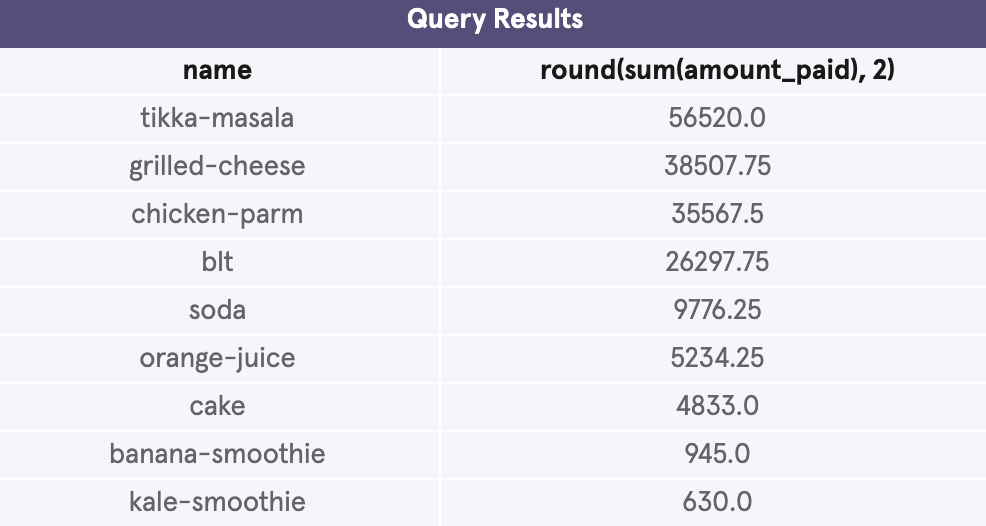
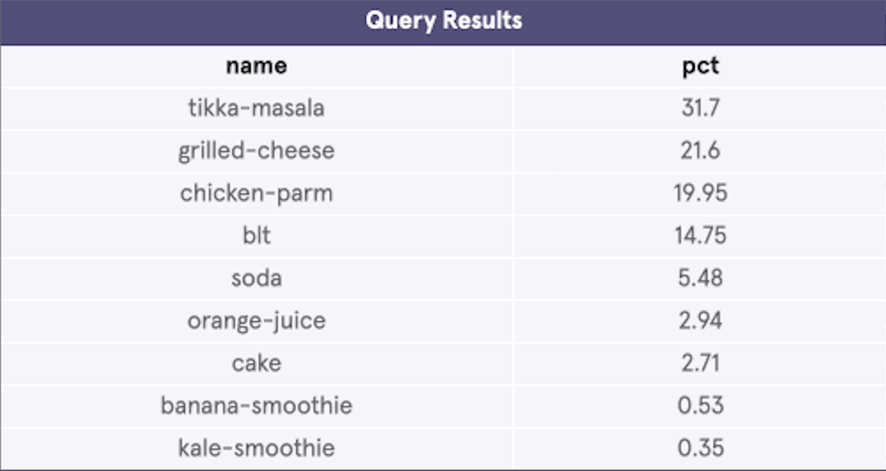
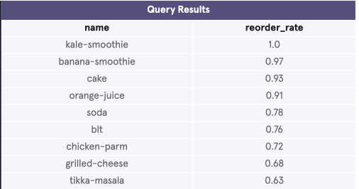

# **SQL Case Study: Food Delivery Analytics**

## **Tools Used**
- **MySQL Workbench**

## **Focus Areas**
- Product Performance
- Revenue Analysis
- Customer Behavior & Retention
- Menu Optimization

---

## **1. Executive Summary**

This case study analyzes operational data from **SpeedySpoon**, a fictional food delivery platform. The goal was to identify top-performing products, understand revenue distribution, and uncover customer retention patterns to support menu strategy and growth decisions.

**Key Highlights:**
- **Tikka Masala** is the clear revenue leader
- Smoothies show the highest customer loyalty (reorder rates)
- Significant opportunity exists to bundle high-revenue items with high-retention products

---

## **2. Business Problem**

SpeedySpoon wants to answer:
- Which products drive the most revenue?
- Which products generate the strongest customer loyalty?
- How can the menu be optimized for maximum growth?

---

## **3. Data Sources**

### `orders` table
- One row per order
- Contains `order_id`, `ordered_at`, `delivered_to` (customer)

### `order_items` table
- One row per item purchased
- Contains `order_id`, `product_name`, `amount_paid`

---

## **4. Key Insights & Results**

### Revenue by Product
**Tikka Masala** generates the highest total revenue, followed by Grilled Cheese and Chicken Parm.

### Revenue Share by Product
Tikka Masala alone accounts for **31.7%** of total revenue.

### Reorder Rate by Product
**Kale Smoothie** and **Banana Smoothie** have the highest reorder rates (1.0 and 0.97), indicating strong customer loyalty.

---

## **5. Key Observations**

- **Revenue Concentration**: The top 3 products (Tikka Masala, Grilled Cheese, Chicken Parm) drive over **73%** of total revenue.
- **Retention vs Revenue Gap**: While Indian and American comfort foods dominate revenue, smoothies show much higher reorder rates.
- **Opportunity**: Cross-selling or bundling high-revenue items with high-retention smoothies could significantly improve customer lifetime value.

---

## **6. Recommendations**

- Promote **smoothies** more aggressively (as sides, combos, or upsells).
- Create combo meals featuring **Tikka Masala + Smoothie**.
- Consider menu engineering: highlight high-margin, high-retention items.
- Explore why smoothies have such high loyalty and replicate those success factors.

---

## **7. SQL Queries**
All queries used in this analysis are available in the [`queries/`](jerrami-online/speedyspoon-analytics/queries) folder.
